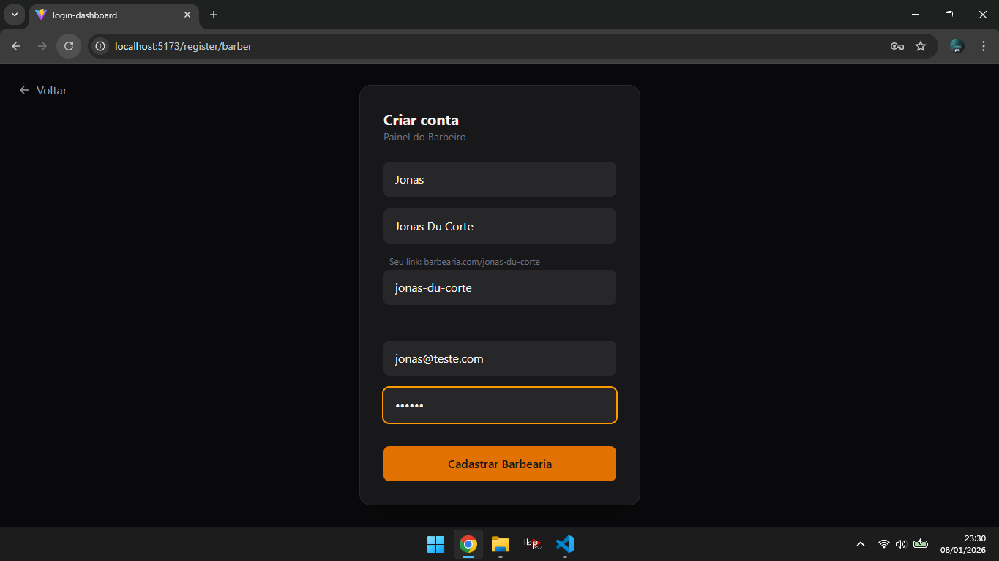
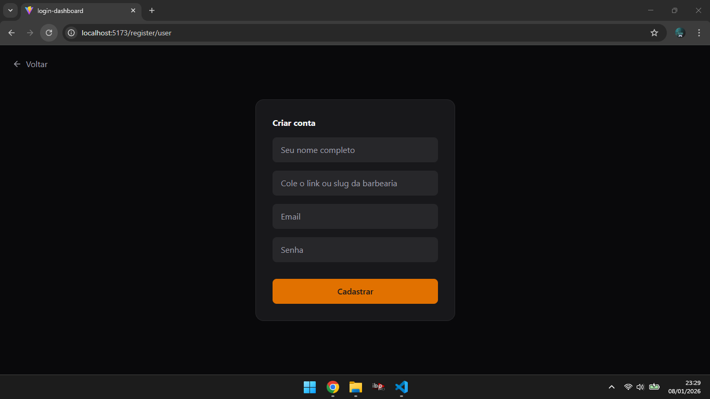
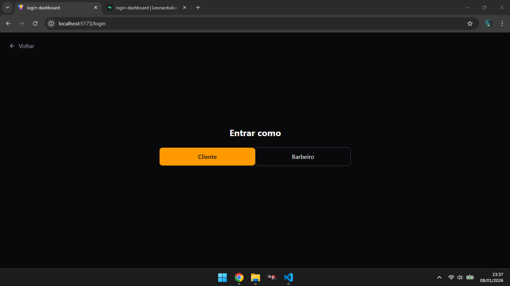
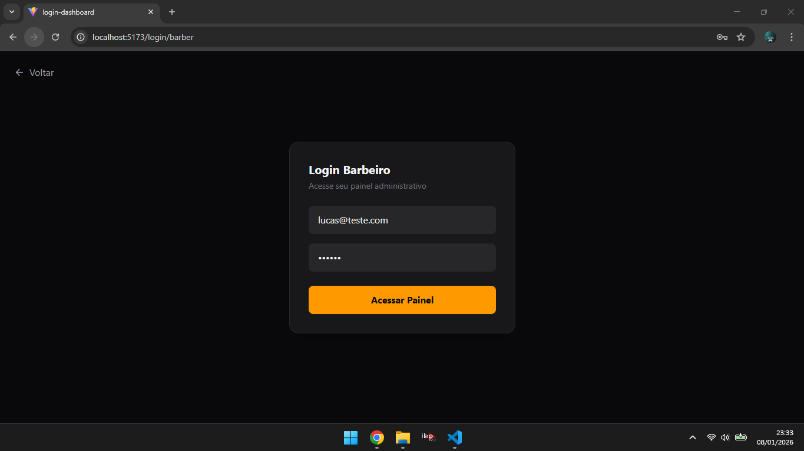
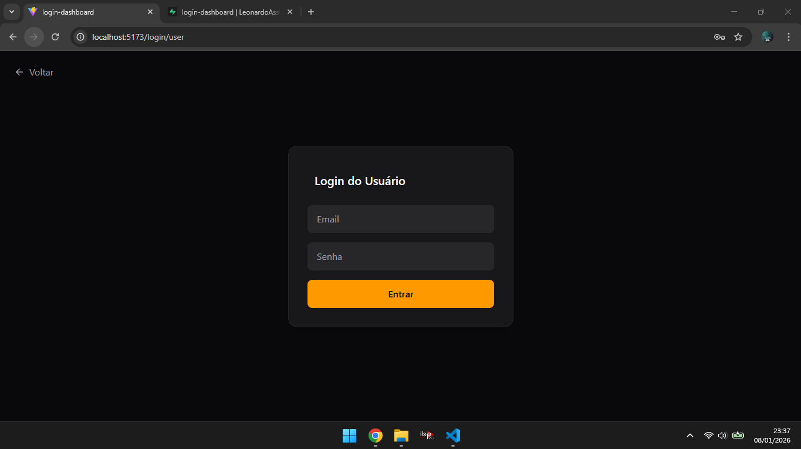
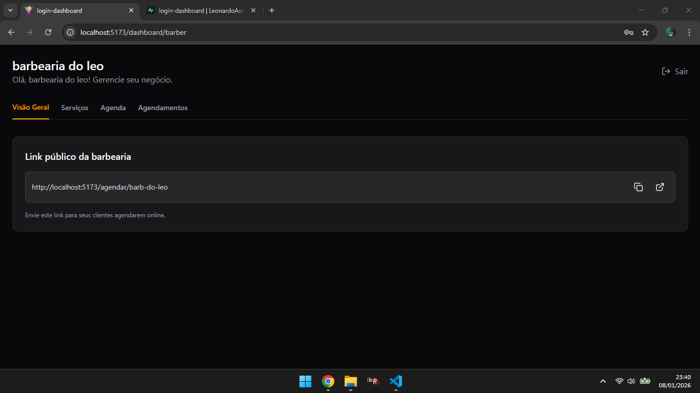

💈 BarberSystem — Sistema de Gestão para Barbearias

O BarberSystem é um sistema web desenvolvido para facilitar a gestão de barbearias, oferecendo uma experiência simples e moderna tanto para clientes quanto para barbeiros.

O projeto foi criado com foco em boas práticas de desenvolvimento, autenticação segura, organização de código e estrutura escalável, simulando um cenário real de aplicação profissional no modelo SaaS.

🎯 Objetivo do Projeto

Criar uma base sólida para um sistema completo de barbearia, permitindo:

Diferenciação clara de perfis (cliente e barbeiro)

Autenticação segura de usuários

Estrutura preparada para agendamentos, serviços e dashboards

Código organizado, reutilizável e fácil de evoluir

Este projeto faz parte do meu processo de transição para a área de desenvolvimento e demonstra minha capacidade de planejar, estruturar e implementar uma aplicação moderna do zero.

🧠 Visão Geral do Sistema

👤 Tipos de Usuário

Cliente

Cria conta e realiza login

Acessa o dashboard do cliente

Visualiza dados de uma barbearia específica através do slug

Barbeiro

Cria conta específica para barbeiros

Realiza login

Acessa o painel do barbeiro

Possui um slug exclusivo da barbearia

Cada tipo de usuário possui:

Fluxo de cadastro separado

Fluxo de login separado

Estrutura de painel independente

✨ Funcionalidades Implementadas

Página inicial apresentando o sistema

Escolha do tipo de conta (cliente ou barbeiro)

Cadastro com e-mail e senha

Login com autenticação via Supabase

Criação automática de perfil no banco de dados

Contexto global de autenticação (AuthContext)

Componentes reutilizáveis

Layout moderno, escuro e responsivo

Navegação entre páginas com React Router

## 📸 Screenshots

As imagens abaixo demonstram o fluxo real da aplicação em funcionamento,
desde a escolha do perfil até os dashboards específicos de cada tipo de usuário.

▶️ Testando o Projeto (Deploy)

O projeto está disponível online e pode ser testado diretamente pelo navegador:

🔗 Deploy na Vercel:
👉 https://barber-system-pink.vercel.app/

✂️ Fluxo 1 — Testando como Barbeiro

Acesse o sistema pelo link acima

Clique em “Sou barbeiro”

Crie uma conta de barbeiro

Após o login, você terá acesso:

Dashboard do barbeiro

Funcionalidades exclusivas do perfil

Slug da barbearia (identificador único)

📌 Guarde o slug, ele será usado no teste como cliente.

💇‍♂️ Fluxo 2 — Testando como Cliente

Volte para a página inicial

Clique em “Sou cliente”

Crie uma conta de cliente

Após o login:

Informe o slug do barbeiro criado anteriormente

Assim, o cliente acessa apenas os dados daquela barbearia específica.

🔄 O que esse fluxo demonstra

Separação clara de perfis

Regras de negócio entre cliente e barbeiro

Uso de slug como identificador público

Estrutura pensada para um SaaS real com múltiplos usuários

🛠️ Tecnologias Utilizadas
⚛️ React + Vite

Componentização

Hooks (useState, useEffect, useContext)

Estrutura moderna e performática

🌐 React Router DOM

Sistema de rotas

Separação de fluxos

Base preparada para proteção de rotas

🔐 Supabase

Autenticação com e-mail e senha

Gerenciamento de sessão

Banco de dados PostgreSQL

Uso de variáveis de ambiente

🎨 Tailwind CSS

Layout responsivo

Tema escuro moderno

Padronização visual

🧩 Lucide React

Ícones leves e modernos

🔄 Context API (AuthContext)

Gerenciamento global de autenticação

Dados do usuário logado

Controle de sessão

🗂️ Estrutura de Pastas
src/
├── components/   # Componentes reutilizáveis
├── context/      # Contextos globais (Auth)
├── lib/          # Configurações externas (Supabase)
├── pages/        # Páginas da aplicação
│   ├── auth/     # Login e cadastro
│   ├── dashboard/# Dashboards
│   └── Home.jsx
├── routes/       # Centralização das rotas
├── App.jsx
└── main.jsx

Essa organização facilita:

Manutenção

Escalabilidade

Leitura do código

Trabalho em equipe

🔐 Variáveis de Ambiente

O projeto utiliza variáveis de ambiente para segurança:

VITE_SUPABASE_URL=
VITE_SUPABASE_ANON_KEY=

Um arquivo .env.example é fornecido como referência.
As chaves reais não são versionadas.

💻 Executando o Projeto Localmente
git clone https://github.com/LeonardoAssis00/barbersystem.git
cd barbersystem
npm install
npm run dev

🚧 Funcionalidades Planejadas

Proteção de rotas por tipo de usuário

Sistema de agendamentos

Controle de horários do barbeiro

Cadastro de serviços

Dashboard com relatórios

Notificações

📈 O Que Este Projeto Demonstra

Capacidade de estruturar um projeto real

Conhecimento em React moderno

Uso consciente de Backend as a Service

Organização de código

Pensamento voltado à escalabilidade

Boas práticas de segurança e versionamento

👨‍💻 Autor

Leonardo Abraão Assis
Estudante de Sistemas de Informação
Desenvolvedor em formação com foco em Web e Mobile
Em busca da primeira oportunidade profissional na área de tecnologia 🚀

📄 Licença

Projeto desenvolvido para fins educacionais e profissionais.
